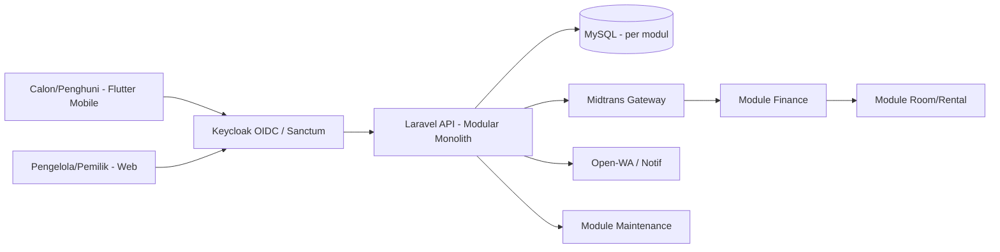

# Arsitektur Sistem — Federated Hub

**Terakhir diupdate:** 2025-09-19
**Stack aktif:** lihat `STACK.md` di folder yang sama
**Scope:** `PA-Management-kost` (PA skripsi + Project sistem)

## Overview

**Refactoring Sistem Manajemen Rumah Kost dengan Arsitektur Modular Monolithic Berbasis Kerangka Kerja Scrum** (Studi Kasus: **Wisma Amal Gorontalo**). Proyek akhir D3 Teknik Informatika PENS yang merefaktorisasi 4 proposal previous work (Juni 2025) menjadi sistem terintegrasi utuh. Mengelola hunian sementara (kost) untuk 3 peran: **Pemilik (Owner), Pengelola (Admin), Penghuni/Calon Penghuni**. Masalah inti: pencatatan manual penghuni/kamar/reservasi/keuangan/maintenance yang tidak terstruktur, rawan human error, tanpa dashboard real-time — serta previous work yang fragmentasi (4 proposal terpisah), arsitektur inkonsisten, test lemah, frontend web hilang, payment sandbox-only.

Sistem dibagi 4 domain layanan + core global, diimplementasi sebagai **Laravel Modules (nwidart/laravel-modules)** di backend dan **Flutter (BLoC + GetIt + AutoRoute)** di frontend — namun tetap terintegrasi dalam satu deployment. Dokumentasi skripsi (PA) dan kode (Project) difederasi via hub ini.

> Ringkasan 1 halaman ada di `STATE.md`. Detail per domain ada di `Project/docs/modules/*`, detail per BAB ada di `PA/docs/modules/*`.

## Tech Stack

| Layer | Teknologi | Catatan |
|---|---|---|
| Frontend Mobile (Penghuni) | Flutter 3.8.1, Dart 3.8.1, BLoC 9.1, GetIt 8.2, AutoRoute 11.1, Dio 5.9, flutter_secure_storage 10 | Clean Architecture (Presentation, Domain, Data) |
| Frontend Web (Semua Peran) | Flutter Web (single codebase dengan Flutter Mobile) | Clean Architecture, Multi-Tenant Switcher, Chat AI MCP |
| Backend | Laravel 11, PHP 8.2, nwidart/laravel-modules 12, Spatie Permission 6.23, Midtrans 2.6, Scramble 0.13 | Modular Monolith (3-Tier, Event-Driven, Module Gateway, MCP Server) |
| Database | MySQL (MVCC, ACID), Eloquent ORM | Skema Multi-Tenant (`buildings`, `building_id` row-level scoping) |
| Auth & Tenancy | Keycloak OIDC IAM + Laravel Sanctum + Spatie RBAC + TenantResolver | SSO terpusat, stateless JWKS verify, tenant-aware RBAC |
| AI Integration | Model Context Protocol (MCP) JSON-RPC Server | Read-only tool execution (laporan, okupansi, maintenance) |
| Payment | Midtrans Payment Gateway | Tagihan otomatis, verifikasi via callback, idempotency |
| Notifikasi | Fonnte / Open-WA (Node.js) + in-app/Email/WhatsApp | Modul Notification |
| Infra | Docker, nginx, Vite, Laravel Pail |  |

> Aturan spesifik per stack ada di `STACK.md`. Jangan duplikasi di sini.

## Struktur Folder Federated

```
PA-Management-kost/
├── Docs/                              # HUB GLOBAL (kamu di sini)
│   ├── 00_overview/
│   │   ├── ARCHITECTURE.md            # index federasi ini
│   │   ├── STATE.md                   # ringkasan 1 halaman
│   │   └── STACK.md                   # fullstack Laravel+Flutter
│   ├── 01_guides/
│   │   ├── GLOSSARY.md
│   │   ├── CONVENTIONS.md
│   │   └── WORKFLOW.md                # Scrum 4 sprint
│   ├── 02_reference/
│   │   ├── API_STYLE.md               # pointer ke backend
│   │   ├── DATABASE_SCHEMA.md         # pointer ke ERD global
│   │   └── INTEGRASI_ANTAR_MODUL.md   # aturan komunikasi modul
│   ├── 03_logs/
│   │   ├── PROGRESS_LOG.md
│   │   ├── DECISIONS.md               # ADR global
│   │   └── CHANGELOG.md
│   └── modules/                       # pointer high-level
│       ├── wisma-core.md
│       ├── room-reservation.md
│       ├── resident-guest.md
│       ├── finance-midtrans.md
│       └── operational-maintenance.md
│
├── PA/                                # SKRIPSI
│   ├── old-files/                     # 4 PDF proposal (sumber knowledge)
│   │   ├── Revisi Sempro 1.pdf        # Manajemen Penghuni & Tamu (Rasyidatur 3123500039)
│   │   ├── Final Proposal PA.pdf      # Kamar & Reservasi (Roihanah 3123500005)
│   │   ├── Proposal Proyek Akhir.pdf  # Keuangan (Rizal 3123500060)
│   │   └── PROPOSAL PROYEK AKHIR _ A4.docx.pdf # Operasional & Maintenance (Bagus 3123500031)
│   ├── diagrams/                      # 15 Diagram Resmi (Mermaid .mmd + Render .png)
│   └── docs/                          # Docs PA komprehensif
│       ├── 00_overview/
│       ├── 01_guides/PANDUAN_PENULISAN.md
│       ├── 02_reference/DAFTAR_PUSTAKA.md, TABEL_JURNAL.md, TEMPLATE_BASELINE.md
│       ├── 03_logs/
│       └── modules/bab1..bab5/
│
└── Project/                           # KODE
    ├── docs/                          # Hub Project (pointer backend+fe)
    ├── backend-wismaamalgorontalo/
    │   ├── KNOWLEDGE_BASE.md          # sumber, akan di-adopt
    │   ├── modules_statuses.json      # Room, Resident, Finance, Maintenance, Auth, Inventory...
    │   ├── Modules/
    │   └── docs/                      # Docs Backend
    └── fe_wisma_amal_gorontalo/
        ├── CLEAN_ARCHITECTURE_GUIDELINE.md
        ├── lib/ (core, data, domain, presentation)
        └── docs/                      # Docs Frontend
```

## Alur Data / Flow Utama



Flow request umum:
1. Login via `Keycloak OIDC` $\rightarrow$ Validasi stateless JWKS $\rightarrow$ JIT Provisioning $\rightarrow$ Sanctum token $\rightarrow$ Spatie RBAC + Tenant Scope.
2. Penghuni: `GET /api/rooms` (Room), `POST /api/reservations` (Schedule), `GET /api/bills` (Finance), `POST /api/maintenance` (Maintenance).
3. Finance callback Midtrans $\rightarrow$ update `tagihan` + `midtrans_transaction` $\rightarrow$ trigger Notif.

Untuk flow per modul, lihat `Project/backend-wismaamalgorontalo/docs/modules/[nama].md` dan `Docs/modules/[nama].md`.

## Daftar Modul (Index Federasi)

> **Aturan modular (AGENTS.md:9):** File ini hanya index. Detail tiap modul ada di `Docs/modules/` dan `Project/docs/modules/` atau `PA/docs/modules/`. AI wajib baca file modul relevan sebelum kerjakan task di modul tersebut.

| Modul | Domain | Deskripsi singkat | Dokumen Global | Dokumen Project | Dokumen PA | Status |
|---|---|---|---|---|---|---|
| **Auth & RBAC** | Core | Keycloak OIDC SSO, Sanctum, Spatie Permission, feature toggle | [modules/wisma-core.md](../modules/wisma-core.md) | `Project/backend/docs/modules/auth.md` | `PA/docs/modules/bab3-auth.md` | Done (Auth) |
| **Room & Reservation** | Room | CRUD kamar, status real-time (kosong/dipesan/terisi harian/bulanan/tahunan), schedule, anti-bentrok | [modules/room-reservation.md](../modules/room-reservation.md) | `Project/backend/docs/modules/room.md` | `PA/docs/modules/bab3-room.md` | WIP |
| **Resident & Guest** | Resident | Profil penghuni, assignment kamar, guest logging, history sewa | [modules/resident-guest.md](../modules/resident-guest.md) | `Project/backend/docs/modules/resident.md` | `PA/docs/modules/bab3-resident.md` | WIP |
| **Finance & Midtrans** | Finance | Tagihan otomatis, Midtrans VA/QRIS, pengeluaran rutin, laporan | [modules/finance-midtrans.md](../modules/finance-midtrans.md) | `Project/backend/docs/modules/finance.md` | `PA/docs/modules/bab3-finance.md` | WIP |
| **Operational & Maintenance** | Ops | Laporan kerusakan (multi-foto), inventory, cleaning schedule, issue tracking | [modules/operational-maintenance.md](../modules/operational-maintenance.md) | `Project/backend/docs/modules/maintenance.md` | `PA/docs/modules/bab3-operational.md` | WIP |
| **Wisma Core** | Core | User Mgmt, RBAC, Notification, Audit Trail, Feature Toggle | [modules/wisma-core.md](../modules/wisma-core.md) | `Project/docs/00_overview/ARCHITECTURE.md` | `PA/docs/00_overview/ARCHITECTURE.md` | Done |

*Jika modul sederhana (<200 baris, 1-3 fitur): 1 file `modules/nama.md`. Jika kompleks (>3 fitur): folder `modules/nama/README.md` + file per fitur.*

## Integrasi Eksternal

| Service | Fungsi | Auth | Docs |
|---|---|---|---|
| Keycloak IAM | Single Sign-On (SSO), OpenID Connect Identity Provider, Social Identity Broker | OIDC / JWKS (RS256) | `PA/docs/modules/bab2/README.md` |
| Midtrans | Payment gateway, Snap token, callback settlement | Server Key | `Project/backend/docs/02_reference/midtrans.md` |
| Open-WA / Fonnte | Notifikasi WhatsApp otomatis (tagihan, jatuh tempo) | API Key | `Project/backend/docs/02_reference/notifikasi.md` |
| Scramble | Auto API docs `/docs/api` | Sanctum | `Project/backend/docs/02_reference/api-reference.md` |

## Environment Variables Penting

| Variable | Fungsi | Wajib? |
|---|---|---|
| `APP_KEY`, `DB_*` | Laravel core + MySQL | Ya |
| `MIDTRANS_SERVER_KEY`, `MIDTRANS_CLIENT_KEY` | Payment | Ya (Finance) |
| `SANCTUM_STATEFUL_DOMAINS` | Auth SPA | Ya |
| `OPENWA_API_URL` | Notifikasi WA | Opsional |

> Cara setup env ada di `Docs/01_guides/GETTING_STARTED.md` dan `Project/backend/.env.example`.

## Catatan Penting untuk AI / Dev Baru

- **Jangan buat file docs baru tanpa L1.** Federasi sudah ada: tiap edit harus update `Docs/03_logs/PROGRESS_LOG.md` + `Docs/00_overview/STATE.md`.
- **Source-first untuk PA:** klaim di `PA/docs/modules/bab*.md` wajib jejak ke `Project/backend/Modules/*` atau `Project/fe/lib/*`. Tanpa bukti -> `[CODE EVIDENCE NEEDED]`.
- **Status sebenarnya** ada di `Project/backend/modules_statuses.json` (Room, Resident, Finance, Maintenance, Inventory aktif).
- **Istilah konsisten** lihat `Docs/01_guides/GLOSSARY.md` (Wisma Amal, Modulith, Penghuni vs Pengelola).
- **Scrum 4 sprint** Maret-Juni 2025: Login → Kamar/Reservasi → Penghuni → Keuangan/Operasional. Lihat `Docs/01_guides/WORKFLOW.md`.
