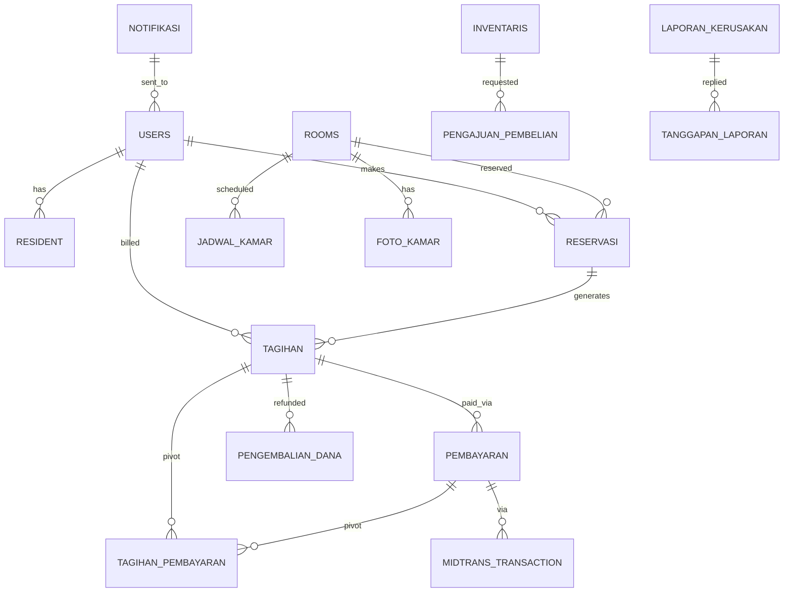

# Skema Database — Wisma Amal Gorontalo (Global ERD)

> Pointer global. Detail per modul ada di `Project/backend/docs/02_reference/DATABASE_SCHEMA.md`. Update tiap ada migration.

**Terakhir diupdate:** 2025-09-19
**Database:** MySQL 8.x

## ERD Global (dari 4 proposal)

> ERD lengkap 3 versi: lihat proposal Penghuni&Tamu (Fig 3.12), Kamar&Reservasi (Fig 3.12), Keuangan (Fig 3.6), Operasional (Fig 3.9). Versi final gabungan ada di `PA/docs/02_reference/ERD_GLOBAL.md`.

## Tabel Inti (ringkas, global)

| Tabel | Modul | Kunci | Deskripsi |
|---|---|---|---|
| `users` | Auth | PK `id` | Akun, FK `role_id` (Spatie) |
| `rooms` | Room | PK | `nomor, lantai, tipe, harga_harian/bulanan/tahunan, status` |
| `reservasi` / `rentals` | Rental | FK `room_id, user_id` | `jenis_sewa, tanggal_mulai, tanggal_selesai, status` |
| `jadwal_kamar` | Room | FK `room_id` | Timeline `Reserved` / `Active Stay` |
| `tagihan` | Finance | FK `user_id, reservasi_id` | `jatuh_tempo, nominal, jenis_sewa, status, original_tagihan_id` |
| `midtrans_transaction` | Finance | FK `tagihan_id, user_id` | `order_id, transaction_id, payment_type, gross/net, status, snap_token` |
| `pembayaran` | Finance | FK `midtrans_transaction_id` | `nominal_bersih, tanggal_pembayaran` |
| `laporan_kerusakan` / `maintenance_requests` | Maintenance | FK `user_id, room_id nullable` | `deskripsi, foto[], status: pending/in_progress/completed` |
| `inventaris` | Inventory | FK `room_id` | `nama, jumlah, kondisi, lokasi` |
| `notifikasi` | Notification | FK `user_id` | `jenis, isi, status_pengiriman, log_error` |
| `log_perubahan` / `audit_trails` | Core | FK `user_aktor_id` | `old_value, new_value` |

## Relasi Kunci

- `reservasi.room_id` → `rooms.id` (many-to-one), cek bentrok via `jadwal_kamar`
- `tagihan.reservasi_id` → `reservasi.id`; `tagihan.original_tagihan_id` self-ref untuk perpanjangan
- `midtrans_transaction.tagihan_id` → `tagihan.id`
- `tagihan_pembayaran` pivot many-to-many `tagihan ↔ pembayaran`
- `laporan_kerusakan.room_id` nullable (umum vs kamar)

## Index Penting

| Tabel | Kolom | Alasan |
|---|---|---|
| `rooms` | `status, tipe` | Filter real-time |
| `jadwal_kamar` | `room_id, tanggal_mulai` | Cek bentrok |
| `tagihan` | `user_id, status, jatuh_tempo` | Tagihan aktif per penghuni |
| `midtrans_transaction` | `order_id` unique | Idempotensi callback |

## Migration History (ringkas)

| Tanggal | File / Modul | Deskripsi |
|---|---|---|
| 2025-03 | `database/migrations/*` | User & Permission global |
| 2025-04 | `Modules/Room/database/migrations/*` | rooms, jadwal_kamar, foto_kamar |
| 2025-05 | `Modules/Resident/database/migrations/*` | resident, guest |
| 2025-06 | `Modules/Finance/database/migrations/*` | tagihan, midtrans_transaction, pembayaran |
| 2025-06 | `Modules/Maintenance/database/migrations/*` | laporan_kerusakan, tanggapan |

## Catatan Khusus

- `status` rooms: `kosong` (0) / `dipesan` (1) / `terisi_harian` / `terisi_bulanan` / `terisi_tahunan` — jangan enum int tanpa docs.
- Refund rule: harian <3 hari, bulanan <7 hari, hanya untuk tagihan reservasi, 50% (lihat Finance proposal).
- ERD final terdokumentasi di `PA/docs/02_reference/DATABASE_SCHEMA.md` untuk BAB 3.

## Untuk AI Agent

- Sebelum buat migration, baca `Project/backend/docs/02_reference/DATABASE_SCHEMA.md` + cek `php artisan migrate:status`
- Update file ini + file modul yang bersangkutan dalam sesi yang sama (AGENTS.md:3 checklist)
