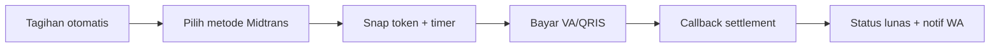

# Module: Finance & Midtrans (Keuangan)

> Pointer high-level. Sumber: proposal Rizal 3123500060 (Manajemen Keuangan).

**Status:** WIP
**Owner:** Project/backend (Finance) + Project/fe + PA

## Deskripsi
Tagihan otomatis, pembayaran Midtrans (VA/QRIS), pengeluaran rutin, laporan keuangan, notifikasi WhatsApp, refund 50%.

## Fitur
- Billing generator: tagihan otomatis per bulan dari data reservasi + tagihan manual (denda)
- Midtrans Snap: VA, QRIS, e-wallet — snap_token + callback settlement/expire
- Auto-update status tagihan → lunas; kamar dipesan → terisi_*
- Pengeluaran rutin (listrik/air/internet) + pengeluaran lain (via inventaris)
- Laporan keuangan tabel + grafik + unduh JPG/Excel
- Notifikasi Open-WA: tagihan baru, H- jatuh tempo, konfirmasi bayar
- Refund: harian <3 hari, bulanan/DP <7 hari, 50%, via Midtrans

## Alur Singkat

## Link Detail
- Kode backend: `Project/backend-wismaamalgorontalo/docs/modules/finance.md`
- Kode frontend: `Project/fe_wisma_amal_gorontalo/docs/modules/finance.md`
- Naskah PA: `PA/docs/modules/bab3-finance.md`
- Tabel kunci: `tagihan`, `midtrans_transaction`, `pembayaran`, `tagihan_pembayaran`, `pengembalian_dana`
