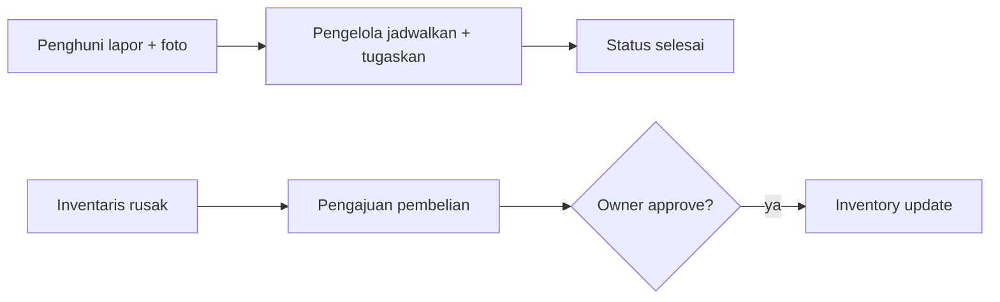

# Module: Operational & Maintenance

> Pointer high-level. Sumber: proposal Bagus 3123500031 (Operasional & Maintenance).

**Status:** WIP
**Owner:** Project/backend (Maintenance, Inventory) + Project/fe + PA

## Deskripsi
Laporan kerusakan digital multi-foto, issue tracking + timeline reply, inventory per kamar, pengajuan pembelian (approve owner), cleaning/maintenance schedule.

## Fitur
- Laporan kerusakan: form + foto, status pending/in_progress/completed/cancelled, nullable room (fasilitas umum)
- Timeline reply admin (tambah foto + ubah status)
- Inventory: data per kamar + kondisi/jumlah, update saat perubahan
- Pengajuan pembelian: pengelola ajukan → pemilik/keuangan approve → inventory update
- Cleaning schedule: jadwal rutin + dari laporan masuk, transparan ke penghuni
- Dashboard real-time: laporan masuk, progres, inventory
- Seeder: `MaintenanceRequestSeeder` (dummy pending/in-progress/completed)

## Alur Singkat

## Link Detail
- Kode backend: `Project/backend-wismaamalgorontalo/docs/modules/maintenance.md` + `inventory.md`
- Kode frontend: `Project/fe_wisma_amal_gorontalo/docs/modules/maintenance.md`
- Naskah PA: `PA/docs/modules/bab3-operational.md`
