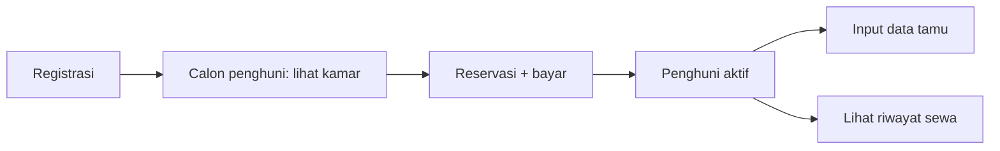

# Module: Resident & Guest (Penghuni & Tamu)

> Pointer high-level. Sumber: proposal Rasyidatur 3123500039 (Revisi Sempro 1).

**Status:** WIP
**Owner:** Project/backend (Resident) + Project/fe + PA

## Deskripsi
Profil penghuni, room assignment, guest logging (tamu menginap/kunjungan), riwayat hunian/kontrak sewa, dashboard monitoring.

## Fitur
- Registrasi + pembuatan akun (calon penghuni → penghuni aktif pasca reservasi+bayar)
- CRUD profil penghuni (pemilik/pengelola), update status penghuni
- Guest logging: penghuni input tamu, pemilik/pengelola input tamu per penghuni
- Resident history: riwayat sewa per penghuni (kontrak, masa tinggal)
- Dashboard penghuni sebagai pusat informasi
- Validasi data penghuni oleh admin

## Alur Singkat

## Link Detail
- Kode backend: `Project/backend-wismaamalgorontalo/docs/modules/resident.md`
- Kode frontend: `Project/fe_wisma_amal_gorontalo/docs/modules/resident.md`
- Naskah PA: `PA/docs/modules/bab3-resident.md`
- Skenario uji: proposal Bab 3.3.8 (13 skenario: akun, login, update penghuni, input tamu)
