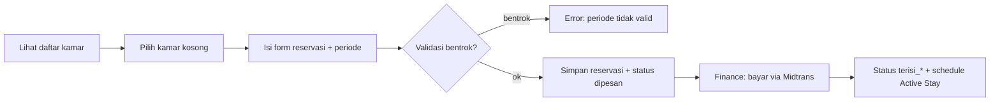

# Module: Room & Reservation (Kamar & Reservasi)

> Pointer high-level. Sumber: proposal Roihanah 3123500005 (Kamar & Reservasi).

**Status:** WIP
**Owner:** Project/backend (Room, Rental) + Project/fe + PA

## Deskripsi
CRUD kamar, status real-time (kosong/dipesan/terisi harian/bulanan/tahunan), room schedule anti-bentrok, reservasi daring, pencatatan urutan reservasi berbasis waktu.

## Fitur
- CRUD kamar + upload foto (min 2, maks 5) — `Modules/Room/` | `PA/docs/modules/bab3-room.md`
- Status real-time + validasi hapus (tolak jika terisi/dipesan)
- Reservasi daring: pilih jenis sewa harian/bulanan/tahunan, validasi konflik jadwal
- Room schedule timeline (pending/ongoing/completed) — dashboard pengelola & pemilik
- Urutan reservasi berbasis waktu (queue calon berikutnya jika batal)
- Auto-update status kamar: kosong → dipesan (saat reservasi) → terisi (pasca bayar valid)

## Alur Singkat

## Link Detail
- Kode backend: `Project/backend-wismaamalgorontalo/docs/modules/room.md` + `rental.md`
- Kode frontend: `Project/fe_wisma_amal_gorontalo/docs/modules/room.md`
- Naskah PA: `PA/docs/modules/bab3-room.md`
- Skenario uji: proposal Bab 3.3.9 (20 skenario: tambah/edit/hapus kamar, reservasi, validasi jadwal)
