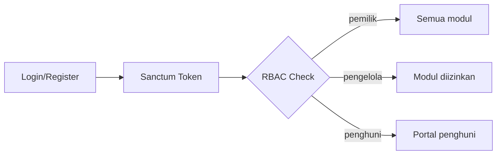

# Module: Wisma Core (Auth, RBAC, Notifikasi, Toggle)

> Pointer high-level. Detail implementasi ada di `Project/*/docs/modules/` dan `PA/docs/modules/`.

**Status:** Done (Auth), WIP (Notif, Toggle)
**Owner:** Project/backend + PA

## Deskripsi
Modul lintas-layanan: autentikasi terpusat multi-role, RBAC modular, notifikasi, audit trail, feature toggle per properti.

## Fitur
- Login/Register multi-role (pemilik, pengelola, penghuni) — `Project/backend-wismaamalgorontalo/Modules/Auth/` | `PA/docs/modules/bab3-core.md`
- RBAC Spatie — hak akses pengelola dibatasi Owner per modul
- Notification System — in-app, email, WhatsApp (Open-WA)
- Audit Trail — `log_perubahan`, aktivitas penting
- Feature Toggle — `modules_statuses.json` aktif/nonaktif per properti (kost/hotel/villa)

## Alur Singkat

## Link Detail
- Kode backend: `Project/backend-wismaamalgorontalo/docs/modules/auth.md`
- Kode frontend: `Project/fe_wisma_amal_gorontalo/docs/modules/auth.md`
- Naskah PA: `PA/docs/modules/bab3-core.md`
- Aturan: `Docs/02_reference/API_STYLE.md` (Auth), `Docs/02_reference/INTEGRASI_ANTAR_MODUL.md`
