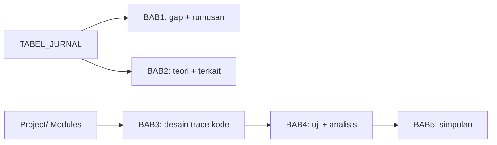

# Arsitektur Naskah — PA Wisma Amal

**Terakhir diupdate:** 2025-09-19
**Aturan tulis:** lihat `01_guides/PANDUAN_PENULISAN.md` + `02_reference/TEMPLATE_BASELINE.md`

## Overview

Naskah Proyek Akhir D3 Teknik Informatika PENS — Pengembangan Sistem Informasi Wisma Amal Gorontalo (Modular Monolith, Scrum). Terdiri dari 5 BAB + front matter + lampiran, mengikuti sistematika 4 proposal di `PA/old-files/`.

## Struktur Naskah

```
ProyekAkhir.docx
├── Cover (judul, nama, NRP, dosen pembimbing + NIP, D3 TI, PENS, 2025)
├── Daftar Isi / Gambar / Tabel
├── BAB 1 Pendahuluan
├── BAB 2 Kajian Pustaka
├── BAB 3 Desain Sistem (Deskripsi Sistem)
├── BAB 4 Eksperimen dan Analisis
├── BAB 5 Penutup
├── Daftar Pustaka (numeric [1], urut kemunculan)
└── Lampiran (kode penting, kuesioner)
```

## Daftar BAB (Index — detail di modules/)

| BAB | Judul | Isi | Dokumen | Status |
|---|---|---|---|---|
| 1 | Pendahuluan | Latar belakang, rumusan (4-5), tujuan, batasan, manfaat, sistematika | [modules/bab1/](./../modules/bab1/) | Draft dari proposal |
| 2 | Kajian Pustaka | Deskripsi permasalahan, teori penunjang (SIM, Modulith, Laravel, Flutter, MySQL, Midtrans), penelitian terkait + Tabel 2.x | [modules/bab2/](./../modules/bab2/) | Butuh lit-review 2022-2026 |
| 3 | Desain Sistem | Deskripsi solusi, Scrum (sprint, backlog, user story), BPMN, Use Case, DFD L0/L1, Activity, ERD, mockup, skenario uji, jadwal | [modules/bab3/](./../modules/bab3/) | WIP — trace ke Project/ |
| 4 | Eksperimen & Analisis | Implementasi + black-box testing + kuesioner + analisis ketercapaian | [modules/bab4/](./../modules/bab4/) | Planned |
| 5 | Penutup | Kesimpulan + saran | [modules/bab5/](./../modules/bab5/) | Planned |

## Alur Penulisan



## Catatan untuk AI

- Tulis draft di `modules/bab*/` sebagai markdown dulu (mudah revisi bimbingan), baru render docx.
- Setiap paragraf yang klaim fitur → tambahkan jejak `(lihat Project/backend/... )` atau sitasi `[n]`.
- Jangan campur gaya 4 proposal (beda sub-judul) — final adalah 1 sistem terintegrasi, lihat `Docs/00_overview/ARCHITECTURE.md`.
