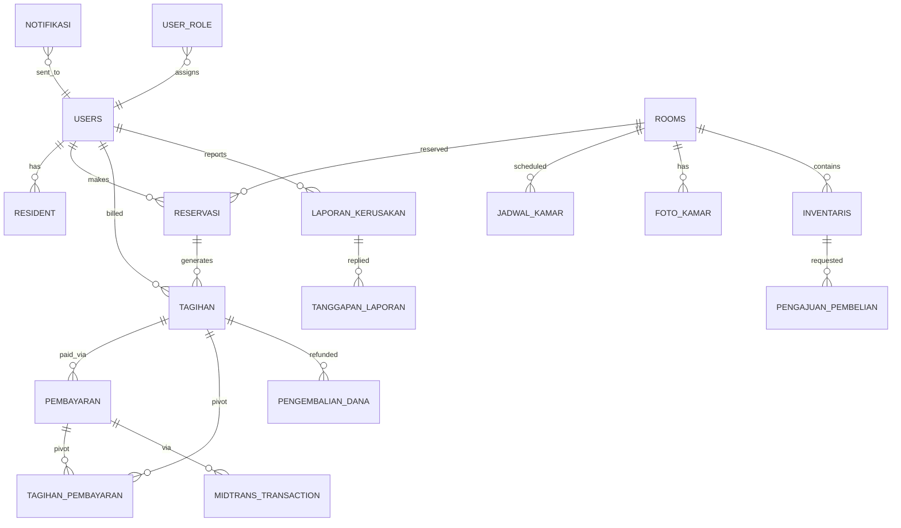

# ERD Global — Gabungan 4 Proposal

> ERD final untuk BAB3. Sumber: Fig 3.12 (Penghuni), Fig 3.12 (Kamar), Fig 3.6 (Keuangan), Fig 3.9 (Operasional). Versi mermaid untuk draft, PNG untuk docx final.

## Catatan Desain

- `laporan_kerusakan.room_id` nullable (fasilitas umum vs kamar).
- `tagihan.original_tagihan_id` self-ref untuk perpanjangan bulanan.
- `midtrans_transaction` = tabel baru krusial (order_id unique, snap_token, expired_at).
- `tagihan_pembayaran` pivot many-to-many (1 bayar ↔ N tagihan, retry support).
- Lihat `Docs/02_reference/DATABASE_SCHEMA.md` untuk kolom lengkap + `Project/backend/docs/02_reference/DATABASE_SCHEMA.md` untuk migration aktual.
