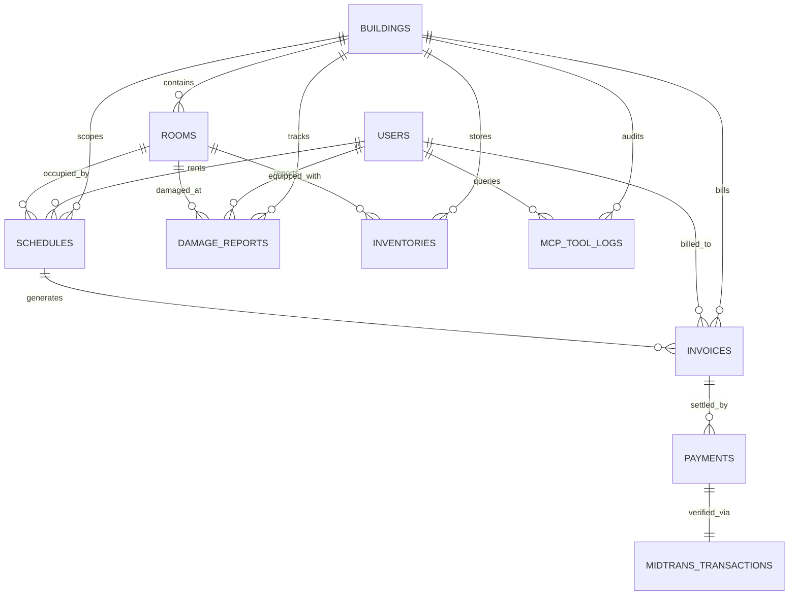

# BAB 3 — Metodologi dan Perancangan Sistem

> Dokumen Resmi Naskah Proyek Akhir — Departemen Teknik Informatika dan Komputer, PENS.
> Format sitasi mengacu pada IEEE numeric `[1]`-`[22]` terurut sesuai kemunculan pertama pada teks.

---

## 3.1 Deskripsi Solusi Terpadu

Proyek Akhir ini merancang dan merefaktorisasi sistem informasi pengelolaan hunian sewa (Wisma Amal Gorontalo) menjadi platform enterprise modern berbasis arsitektur terpadu:

```
┌─────────────────────────────────────────────────────────────────────────┐
│               ARSITEKTUR TERPADU SISTEM INFORMASI WISMA                 │
├─────────────────────────────────────────────────────────────────────────┤
│ 1. Frontend Multi-Platform: Clean Architecture pada Flutter             │
│    (Single Codebase Web Dashboard & Mobile Application)                 │
├─────────────────────────────────────────────────────────────────────────┤
│ 2. Backend Modular Monolith (3-Tier Module Hierarchy):                  │
│    • Infrastructure Tier : Auth & Keycloak OIDC SSO, System Setting     │
│    • Core Tier           : Multi-Tenant Building, Room, Schedule        │
│    • Business Modules    : Finance, Maintenance, Guest, Inventory,      │
│                            Notification, MCP Server                     │
├─────────────────────────────────────────────────────────────────────────┤
│ 3. Komunikasi Decoupled: Internal Event Bus (Write) & Gateway (Read)    │
├─────────────────────────────────────────────────────────────────────────┤
│ 4. Multi-Tenancy: Shared Database with Row-Level Scoping (building_id)  │
├─────────────────────────────────────────────────────────────────────────┤
│ 5. Federated Identity: Single Sign-On (SSO) Berbasis Keycloak OIDC      │
├─────────────────────────────────────────────────────────────────────────┤
│ 6. AI Interface: Model Context Protocol (MCP) Read-Only Tool Execution  │
└─────────────────────────────────────────────────────────────────────────┘
```

Pendekatan ini menjamin bahwa sistem memiliki skalabilitas tinggi dalam mengelola portofolio multi-gedung, modularitas independen di mana setiap modul bisnis dapat diaktifkan atau dinonaktifkan tanpa memicu kegagalan sistem (*graceful degradation*), otentikasi terpusat yang aman via Keycloak OpenID Connect, standarisasi format data yang *type-safe*, serta kemudahan penarikan wawasan operasional secara cerdas bagi pemilik properti melalui asisten AI terintegrasi.

---

## 3.2 Metodologi Pengembangan Perangkat Lunak (Kerangka Kerja Scrum)

Pengembangan sistem dilaksanakan menggunakan kerangka kerja tangkas (*Agile*) **Scrum** yang terbagi ke dalam 4 siklus *sprint* berdurasi total 8 minggu (masing-masing sprint berlangsung selama 2 minggu). Metodologi ini dipilih untuk memfasilitasi integrasi bertahap, pengujian berkelanjutan, dan adaptasi cepat terhadap kebutuhan pemangku kepentingan (*stakeholders*) [17][20].

```
┌─────────────────────────────────────────────────────────────────────────┐
│                   ALUR KERANGKA KERJA SCRUM (4 SPRINT)                  │
│                                                                         │
│   Product Backlog ──> Sprint Planning ──> Sprint Execution (2 Minggu)  │
│                              │                      │                   │
│                              ▼                      ▼                   │
│                     Daily Standup Meeting    Sprint Review & Retro      │
│                                                     │                   │
│                                                     ▼                   │
│                                      Potentially Shippable Increment    │
└─────────────────────────────────────────────────────────────────────────┘
```

### 3.2.1 Struktur Tim dan Peran Scrum
1. **Product Owner (PO):** Pemilik Wisma Amal Gorontalo dan Dosen Pembimbing yang bertindak menentukan prioritas kebutuhan bisnis, menyetujui *Product Backlog Items* (PBI), dan memvalidasi kriteria penerimaan (*Acceptance Criteria*).
2. **Scrum Master (SM):** Memfasilitasi upacara Scrum (*Sprint Planning*, *Daily Standup*, *Sprint Review*, *Sprint Retrospective*), mengeliminasi hambatan teknis (*blockers*), dan menegakkan aturan modularitas.
3. **Development Team:** Mahasiswa pengembang yang bertanggung jawab secara *cross-functional* atas rekayasa backend Laravel, frontend Flutter, integrasi database MySQL, integrasi MCP AI, dan penulisan pengujian terotomasi.

### 3.2.2 Pembagian Siklus Sprint dan Rincian Backlog

```
┌────────────────────────────────────────────────────────────────────────────────────────────────────────┐
│                                 TABEL 3.1 PERENCANAAN 4 SPRINT SCRUM                                   │
├────────┬───────────────┬──────────────────────────────────────────┬──────────────┬─────────────────────┤
│ Sprint │ Durasi        │ Fokus Utama & Deliverables               │ Story Points │ Definition of Done  │
├────────┼───────────────┼──────────────────────────────────────────┼──────────────┼─────────────────────┤
│ 1      │ Minggu 1 – 2  │ Foundation, Tenancy, & API Standards:    │ 24           │ • DB Tenant & Auth  │
│        │               │ • Modul Auth & Spatie RBAC 78 permissions│              │ • Middleware scope  │
│        │               │ • Entitas Building & TenantResolver      │              │ • Envelope baku 200 │
│        │               │ • Module Gateway & Trait ApiResponse     │              │ • CI/CD pipeline OK │
├────────┼───────────────┼──────────────────────────────────────────┼──────────────┼─────────────────────┤
│ 2      │ Minggu 3 – 4  │ Core Domain & Event-Driven Engine:       │ 32           │ • Room CRUD multi-bldg│
│        │               │ • Modul Room & Master Fasilitas          │              │ • Schedule sewa FSM │
│        │               │ • Modul Schedule Core (pengganti Rental) │              │ • Pessimistic lock  │
│        │               │ • Event Catalog (JadwalDibuat, dsb.)     │              │ • Unit test pass    │
├────────┼───────────────┼──────────────────────────────────────────┼──────────────┼─────────────────────┤
│ 3      │ Minggu 5 – 6  │ Business Modules & Payment Integration:  │ 30           │ • Tagihan otomatis  │
│        │               │ • Modul Finance & Midtrans SNAP Prod     │              │ • Webhook signature │
│        │               │ • Modul Maintenance, Guest, Inventory    │              │ • Open-WA / Fonnte  │
│        │               │ • Modul Notification Listener Event      │              │ • Integration test  │
├────────┼───────────────┼──────────────────────────────────────────┼──────────────┼─────────────────────┤
│ 4      │ Minggu 7 – 8  │ Clean Frontend, MCP AI & System Hardening│ 28           │ • Web & Mobile UI   │
│        │               │ • Flutter Web Dashboard Multi-Building   │              │ • MCP Tools 4 func  │
│        │               │ • Modul MCP Server & Chatbot AI Tab      │              │ • Tenant test pass  │
│        │               │ • UAT & Final System Hardening           │              │ • Coverage >= 80%   │
└────────┴───────────────┴──────────────────────────────────────────┴──────────────┴─────────────────────┤
│ TOTAL  │ 8 Minggu      │ 4 Increment Terintegrasi                 │ 114 SP       │ Ready for Production│
└────────┴───────────────┴──────────────────────────────────────────┴──────────────┴─────────────────────┘
```

### 3.2.3 Contoh Spesifikasi User Story & Acceptance Criteria
Setiap kebutuhan dijabarkan dalam format formal User Story disertai kriteria penerimaan berbasis skenario *Gherkin* (*Given-When-Then*):

- **User Story US-01 (Reservasi Kamar Multi-Gedung):**
  *Sebagai* Calon Penghuni, *Saya ingin* memesan kamar pada gedung tertentu secara online dan menerima konfirmasi instan, *Agar* saya mendapatkan kepastian kamar tanpa risiko bentrok jadwal.
  - **Skenario Penerimaan (Pemesanan Berhasil):**
    *Given* Kamar A-01 di Gedung Utama berstatus kosong pada rentang 2026-11-01 s/d 2026-11-30.
    *When* Pengguna mengajukan reservasi dan membayar via Midtrans SNAP.
    *Then* Sistem menerbitkan event `JadwalSewaAktif`, mengubah status kamar menjadi `terisi_bulanan`, dan mengirimkan bukti invoice ke WhatsApp pengguna.
  - **Skenario Penerimaan (Bentrok Jadwal Konkuren):**
    *Given* Kamar A-01 sedang dalam proses penguncian transaksi oleh pengguna lain.
    *When* Pengguna kedua mencoba mengajukan reservasi pada tanggal yang tumpang tindih.
    *Then* Sistem menolak transaksi kedua dengan kode HTTP 422 ("Kamar sedang diproses atau sudah terisi").

---

## 3.3 Perancangan Arsitektur Sistem

Sistem dirancang dengan arsitektur **Clean-Modulith + MCP AI** yang menghubungkan antarmuka multi-platform dengan backend modular terisolasi:

```
┌─────────────────────────────────────────────────────────────────────────┐
│                        FRONTEND (Clean Architecture)                    │
│   Flutter Mobile (Penghuni)  &  Flutter Web (Owner, Pengelola, Penghuni)│
│   ┌───────────────────┐ ┌───────────────┐ ┌─────────────────────────┐   │
│   │ Presentation (UI) │ │ Domain (Core) │ │ Data (Datasource + DTO) │   │
│   │ • BLoC / Widgets  │ │ • Entities    │ │ • Dio Interceptors      │   │
│   │ • BuildingSwitch  │ │ • UseCases    │ │ • Model / Serializers   │   │
│   │ • AI Chat Panel   │ │ • Repositories│ │ • Secure Storage Cache  │   │
│   └───────────────────┘ └───────────────┘ └─────────────────────────┘   │
└────────────────────────────────────┬────────────────────────────────────┘
                                     │ Standard JSON I/O (REST API / X-Building-ID)
                                     ▼
┌─────────────────────────────────────────────────────────────────────────┐
│                       BACKEND (Modular Monolith)                        │
│                                                                         │
│   [API Gateway / Router / Auth Middleware / Tenant Resolver]            │
│                                │                                        │
│   ┌────────────────────────────┼────────────────────────────────────┐   │
│   │                     MODULE GATEWAY LAYER                        │   │
│   │                                                                 │   │
│   │  Infrastructure Tier:    Business Modules (Independent):        │   │
│   │  • Auth & RBAC (Spatie)  • Finance (Midtrans SNAP & Rekap)      │   │
│   │  • Setting & Toggles     • Maintenance (Tiket Komplain)         │   │
│   │                          • Guest & Inventory                    │   │
│   │  Core Tier:              • Notification (WhatsApp Gateway)      │   │
│   │  • Building (Tenant)     • MCP Server (AI Tool-Use API) ★       │   │
│   │  • Room & Schedule Core                                         │   │
│   └────────────────────────────┼────────────────────────────────────┘   │
│                                │ Internal Events (Asynchronous Bus)     │
│                                ▼                                        │
│              DATABASE (Multi-Tenant Row-Level Scoping)                  │
│              • Shared MySQL Database with building_id scoping           │
└─────────────────────────────────────────────────────────────────────────┘
```

> **Gambar 3.1 — Arsitektur Sistem Terpadu (C4 Container, FINAL):** `PA/docs/diagrams/01_arsitektur_sistem_terpadu/c4_level2_container_wisma_amal.svg`.
>
> **Gambar 3.2 — Dekomposisi Modulith 3-Tier (Component, FINAL):** `PA/docs/diagrams/02_hierarki_3_tier_modulith/component_diagram_modular_monolith_3_tier.svg`. Kedua SVG ini adalah diagram resmi yang dipakai untuk docx; file `.mmd`/`.png` lama di masing-masing folder disupersede.

---

## 3.4 Pemodelan Proses Bisnis (BPMN)

Proses bisnis utama dimodelkan menggunakan *Business Process Model and Notation* (BPMN 2.0) dengan pembagian *swimlane* antar aktor:

### 3.4.1 BPMN Alur Reservasi Kamar & Pembayaran Otomatis Midtrans

```
┌──────────────┬──────────────────────────────────────────────────────────┐
│ PENGHUNI     │ [Pilih Gedung & Kamar] ──> [Isi Form] ──> [Bayar SNAP]   │
├──────────────┼──────────────────────────────────────────────────────────┤
│ SISTEM CORE  │ [Verifikasi Ketersediaan] ──> [Kunci Kamar Pessimistic]  │
│ (Schedule)   │                              │ (Emit Event Jadwal)       │
├──────────────┼──────────────────────────────▼───────────────────────────┤
│ MODUL BISNIS │                              [Terbitkan Invoice Tagihan] │
│ (Finance)    │                              │                           │
├──────────────┼──────────────────────────────▼───────────────────────────┤
│ MIDTRANS     │                              [Proses VA/QRIS] ──> [Settled]
├──────────────┼─────────────────────────────────────────────────────│────┤
│ NOTIFIKASI   │ [Kirim WhatsApp Konfirmasi Sukses] <────────────────┘    │
└──────────────┴──────────────────────────────────────────────────────────┘
```

1. **Pemilihan Kamar:** Penghuni memilih gedung dan kamar kosong melalui aplikasi web/mobile.
2. **Penguncian Jadwal:** Modul `Schedule` melakukan verifikasi ketersediaan kamar dengan `SELECT ... FOR UPDATE` di dalam transaksi database dan menerbitkan event `JadwalDibuat`.
3. **Penerbitan Invoice:** Modul `Finance` menangkap event dan menerbitkan tagihan digital serta meminta *SNAP Token* ke server Midtrans.
4. **Pembayaran & Settlement:** Penghuni menyelesaikan pembayaran via VA/QRIS. Webhook callback Midtrans memverifikasi signature dan memicu event `PembayaranDiterima`.
5. **Aktivasi Sewa & Notifikasi:** Modul `Schedule` mengubah status kamar menjadi `terisi_sewa` dan modul `Notification` mengirimkan pesan konfirmasi resmi ke WhatsApp penghuni.

### 3.4.2 BPMN Alur Penanganan Tiket Komplain Kerusakan Fasilitas

```
┌──────────────┬──────────────────────────────────────────────────────────┐
│ PENGHUNI     │ [Unggah Foto & Laporan Kerusakan]                        │
├──────────────┼─────────────────────────│────────────────────────────────┤
│ MAINTENANCE  │                         ▼                                │
│ MODULE       │ [Buat Tiket Kerusakan] ──> [Emit LaporanKerusakanMasuk]  │
├──────────────┼─────────────────────────────────────────│────────────────┤
│ PENGELOLA    │ [Verifikasi & Tugaskan Teknisi] <───────┘                │
│              │ [Perbaikan Selesai & Update Tiket] ──> [Selesai]         │
├──────────────┼──────────────────────────────────────────│───────────────┤
│ NOTIFIKASI   │ [Kirim Pesan Update Pengerjaan ke Penghuni] <────────────┘
└──────────────┴──────────────────────────────────────────────────────────┘
```

### 3.4.3 BPMN Alur Konsultasi & Wawasan AI via Model Context Protocol (MCP)

```
┌──────────────┬──────────────────────────────────────────────────────────┐
│ PEMILIK /    │ [Kirim Pertanyaan Teks: "Berapa okupansi Gedung A?"]     │
│ PENGELOLA    │                            │                             │
├──────────────┼────────────────────────────▼─────────────────────────────┤
│ LLM ENGINE   │ [Analisis Pertanyaan] ──> [Pilih Tool get_occupancy]     │
├──────────────┼────────────────────────────────────────────│─────────────┤
│ MCP SERVER   │ [Validasi Token & Tenant] <────────────────┘             │
│ (Backend)    │ [Eksekusi Kueri Basis Data via Module Gateway]           │
│              │ [Return Data JSON Faktual ke LLM] ───────────────────────┐
├──────────────┼──────────────────────────────────────────────────────────┤
│ LLM & UI     │ [LLM Sintesis Narasi Terstruktur] ──> [Tampilkan di UI]  │
└──────────────┴──────────────────────────────────────────────────────────┘
```

---

## 3.5 Pemodelan Fungsional Sistem (Use Case & DFD)

### 3.5.1 Diagram Use Case Global

```
                        ┌─────────────────────────┐
                        │   WISMA AMAL SYSTEM     │
                        ├─────────────────────────┤
   ( Pemilik Properti ) ───> ( UC-01: Kelola Multi-Gedung & Kamar )
                        │   ( UC-04: Analitik AI via MCP )
                        │                         │
   ( Pengelola Gedung ) ───> ( UC-01: Kelola Kamar Gedung Binaan )
                        │   ( UC-03: Kelola Tiket Maintenance )
                        │   ( UC-04: Analitik AI via MCP )
                        │                         │
   ( Penghuni / Calon ) ───> ( UC-02: Reservasi & Bayar Midtrans )
                        │   ( UC-03: Ajukan Komplain Kerusakan )
                        └─────────────────────────┘
```

### 3.5.2 Spesifikasi Use Case (Use Case Specifications)

#### 1. UC-01: Pengelolaan Gedung dan Kamar
- **Aktor Utama:** Pemilik (*Owner*), Pengelola (*Admin*).
- **Prakondisi:** Pengguna telah login dan memiliki token otentikasi Bearer yang valid dengan hak akses `manage-building` atau `manage-room`.
- **Postkondisi:** Data master gedung dan kamar tersimpan pada basis data dengan isolasi `building_id` yang sesuai.
- **Alur Utama:**
  1. Pengguna membuka menu Kelola Gedung/Kamar pada Web Dashboard.
  2. Sistem menampilkan daftar gedung/kamar sesuai batasan hak akses tenant.
  3. Pengguna mengisi form penambahan/perubahan unit kamar (nomor, tipe, tarif dasar, fasilitas, foto).
  4. Sistem memvalidasi masukan data melalui FormRequest.
  5. Sistem menyimpan entitas data ke tabel `rooms` dan mengembalikan respons envelope JSON 201 Created.
- **Alur Alternatif (Validasi Gagal):**
  4a. Nomor kamar telah terdaftar pada gedung yang sama.
  4b. Sistem membatalkan penyimpanan dan mengembalikan respons HTTP 422 dengan pesan error spesifik.

#### 2. UC-02: Reservasi Kamar dan Pembayaran Digital Midtrans
- **Aktor Utama:** Penghuni / Calon Penghuni.
- **Prakondisi:** Kamar berstatus kosong pada periode yang dipilih.
- **Postkondisi:** Jadwal sewa aktif tercatat, tagihan berstatus lunas, dan notifikasi WhatsApp terkirim.
- **Alur Utama:**
  1. Penghuni memilih gedung, kamar, dan durasi sewa (harian/bulanan/tahunan).
  2. Penghuni menekan tombol "Lanjutkan Pembayaran".
  3. Sistem mengunci baris jadwal kamar menggunakan *pessimistic lock* dan menerbitkan event `JadwalDibuat`.
  4. Modul Finance membuat invoice dan mengembalikan SNAP Token Midtrans ke antarmuka klien.
  5. Penghuni menyelesaikan transaksi melalui portal pembayaran SNAP.
  6. Webhook Midtrans mengirimkan notifikasi callback settlement ke backend.
  7. Sistem memvalidasi signature SHA-512, memperbarui status tagihan menjadi lunas, dan mengaktifkan jadwal sewa.

#### 3. UC-04: Konsultasi Wawasan Bisnis via Asisten AI (MCP)
- **Aktor Utama:** Pemilik, Pengelola.
- **Prakondisi:** Pengguna terautentikasi dan berada pada tab Chat AI Asisten.
- **Postkondisi:** Wawasan operasional ditampilkan dalam bentuk narasi alami dan tabel ringkas, tercatat dalam audit log.
- **Alur Utama:**
  1. Pengguna mengetikkan pertanyaan bisnis (contoh: "Berapa total tagihan yang belum dibayar di Gedung Melati?").
  2. Client mengirimkan prompt ke LLM Engine.
  3. LLM mengidentifikasi kebutuhan pemanggilan tool `get_financial_summary(building_id: 2, status: 'unpaid')`.
  4. MCP Server memverifikasi izin pengguna terhadap `building_id` = 2.
  5. MCP Server mengeksekusi kueri agregasi melalui *Module Gateway* dan mengembalikan data JSON mentah ke LLM.
  6. LLM menyusun respons penjelasan terstruktur berdasarkan data faktual tersebut.
  7. Antarmuka menampilkan jawaban lengkap beserta tabel rincian data ke pengguna.

---

### 3.5.3 Data Flow Diagram (DFD)

#### 1. DFD Level 0 (Context Diagram)

```
┌──────────────┐     Data Registrasi, Reservasi, Komplain     ┌─────────────────┐
│   Penghuni   │ ───────────────────────────────────────────> │                 │
│              │ <─────────────────────────────────────────── │                 │
└──────────────┘     Status Kamar, Invoice SNAP, Notif WA     │                 │
                                                              │  SISTEM WISMA   │
┌──────────────┐     Konfigurasi Gedung, Tarif, Audit MCP     │  AMAL TERPADU   │
│   Pemilik /  │ ───────────────────────────────────────────> │  (CLEAN-MODULITH│
│  Pengelola   │ <─────────────────────────────────────────── │   + MCP AI)     │
└──────────────┘     Dashboard KPI, Laporan, Jawaban AI       │                 │
                                                              │                 │
┌──────────────┐     SNAP Token Request, Signature Notif      │                 │
│   Midtrans   │ <──────────────────────────────────────────> │                 │
└──────────────┘                                              └─────────────────┘
```

#### 2. DFD Level 1 (Dekomposisi Fungsional Sistem)
Proses dekomposisi Level 1 membagi sistem ke dalam 6 proses utama:
- **Proses 1.0 Manajemen Otentikasi & Tenant:** Mengelola login pengguna, pembagian peran Spatie RBAC, dan resolusi identitas gedung (`D1: Users`, `D2: Buildings`).
- **Proses 2.0 Manajemen Kamar & Penjadwalan Core:** Mengelola ketersediaan fisik kamar dan linimasa sewa (`D3: Rooms`, `D4: Schedules`).
- **Proses 3.0 Manajemen Keuangan & Transaksi Midtrans:** Mengelola penagihan otomatis dan verifikasi pembayaran SNAP (`D5: Invoices`, `D6: Payments`, `D7: Midtrans_Logs`).
- **Proses 4.0 Manajemen Pemeliharaan & Operasional:** Mengelola tiket komplain kerusakan dan inventaris aset (`D8: Damage_Reports`, `D9: Inventories`).
- **Proses 5.0 Layanan Notifikasi Otomatis:** Mengirimkan pesan WhatsApp/Email berdasarkan event (`D10: Notification_Logs`).
- **Proses 6.0 Antarmuka Asisten Cerdas MCP:** Mengeksekusi tool komputasi analitik dan mencatat jejak audit query AI (`D11: MCP_Tool_Logs`).

---

## 3.6 Perancangan Basis Data Relasional (ERD & Kamus Data)

### 3.6.1 Entity Relationship Diagram (ERD) Keseluruhan Database

> **Gambar 3.6a — ERD Keseluruhan Database Aktual (FINAL, hasil audit migration 2026-10-03):** `PA/docs/diagrams/12_erd_multi_tenant_global/erd_full_database.mmd` / `.png` — 39 tabel hasil audit (Auth/global, Room, Schedule, Finance, Maintenance, Guest, Inventory, Notification, Setting; 41 tabel pasca-migration WAJIB 2026-10-03) dengan relasi FK fisik + soft-ref utama. Inventaris lengkap ada di `Docs/02_reference/DATABASE_SCHEMA.md`.
>
> **Gambar 3.6b — ERD Target Desain Multi-Tenant (konseptual):** `PA/docs/diagrams/12_erd_multi_tenant_global/erd_multi_tenant_global.mmd` / `.png` — sentral `buildings` + `building_id` scoping. Per 2026-10-03 skema ini SUDAH terimplementasi di kode via migration `2026_10_03_000001/000002` (41 tabel).
>
> **Gambar 3.6c–3.6g — ERD Per Domain Cluster (FINAL, untuk keterbacaan docx):** `PA/docs/diagrams/12_erd_multi_tenant_global/permodule/erd_1_auth_rbac.html` s.d. `erd_5_setting_pendukung.html` — 5 file terverifikasi akurat terhadap audit migration (FK fisik vs soft-ref dibedakan).
>
> **Delta aktual vs target:** `buildings`/`building_id`, `users.keycloak_id`, dan `mcp_tool_logs` per 2026-10-03 SUDAH terimplementasi di kode — lihat status terkini di `Docs/02_reference/DATABASE_SCHEMA.md` §5.

### 3.6.2 Entity Relationship Diagram (ERD) Target Multi-Tenant



### 3.6.3 Matriks Ketertelusuran: 12 Modul Arsitektur ke 5 Domain Cluster ERD

Seluruh skema basis data relasional sistem Wisma Amal dikelompokkan ke dalam 5 *Bounded Context* / Domain Cluster yang menaungi 12 modul arsitektur pada Gambar 3.2. Pengelompokan ini mengikuti prinsip *Domain-Driven Design*: diagram ERD disusun berdasarkan keterkaitan domain bisnis (agar relasi antar tabel tetap utuh dan terbaca), bukan dipaksakan satu diagram per satu folder modul fisik.

```
┌────────────────────────────────────────────────────────────────────────────────────────────────────────┐
│              TABEL 3.3 MATRIKS KETERTELUSURAN MODUL → DOMAIN CLUSTER → FILE ERD                        │
├────────┬──────────────────────┬──────────────────────────────────┬──────────────────────────────────────┤
│ No │ Domain Cluster (File ERD) │ Modul yang Dinaungi              │ Tabel Utama                          │
├────────┼──────────────────────┼──────────────────────────────────┼──────────────────────────────────────┤
│ 1 │ Cluster 1 — Identity &   │ Auth                             │ users, user_profiles, roles,           │
│   │ Access (erd_1_auth_rbac) │                                  │ permissions + 3 pivot Spatie,          │
│   │                          │                                  │ personal_access_tokens                 │
├────────┼──────────────────────┼──────────────────────────────────┼──────────────────────────────────────┤
│ 2 │ Cluster 2 — Space &      │ Building*, Room, Schedule, Guest │ rooms, room_images, room_schedules,    │
│   │ Occupancy Core           │                                  │ guests, guest_bills,                   │
│   │ (erd_2_kamar_jadwal_tamu)│                                  │ guest_active_contexts                  │
├────────┼──────────────────────┼──────────────────────────────────┼──────────────────────────────────────┤
│ 3 │ Cluster 3 — Financial    │ Finance                          │ invoices, payments, fines,             │
│   │ Management               │                                  │ fine_invoice, refund_requests,         │
│   │ (erd_3_keuangan)         │                                  │ expenses, fixed_expense_entries,       │
│   │                          │                                  │ finance_active_tenants                 │
├────────┼──────────────────────┼──────────────────────────────────┼──────────────────────────────────────┤
│ 4 │ Cluster 4 — Maintenance  │ Maintenance                      │ maintenance_requests + images/         │
│   │ & Helpdesk               │                                  │ updates, maintenance_schedules +       │
│   │ (erd_4_maintenance)      │                                  │ updates                                │
├────────┼──────────────────────┼──────────────────────────────────┼──────────────────────────────────────┤
│ 5 │ Cluster 5 — Configuration│ Setting, Inventory,              │ app_settings, bank_accounts,           │
│   │ & Utilities              │ Notification, Mcp*               │ feature_toggles (+logs), inventories,  │
│   │ (erd_5_setting_pendukung) │                                  │ notification_logs                      │
└────────┴──────────────────────┴──────────────────────────────────┴──────────────────────────────────────┘
```

Keterangan:
- Tanda `*`: `Building` (`buildings`) dan `Mcp` (`mcp_tool_logs`) per 2026-10-03 SUDAH terimplementasi di kode via migration aditif — lihat status terkini di `Docs/02_reference/DATABASE_SCHEMA.md` §5.
- Modul `Dashboard` tidak memiliki tabel karena murni kueri agregasi baca lintas modul via Module Gateway.
- Modul satu tabel (`Inventory`, `Notification`) digabung ke Cluster 5 agar tidak menjadi diagram tersendiri yang hanya berisi satu kotak tanpa relasi.

### 3.6.4 Kamus Data Basis Data (Database Data Dictionary)

#### 1. Tabel `users` (Entitas Pengguna & Integrasi Keycloak SSO)
| Nama Kolom | Tipe Data | Nullable | Kunci | Deskripsi Bisnis |
|---|---|---|---|---|
| `id` | BIGINT UNSIGNED | No | PK | Pengidentifikasi unik pengguna lokal |
| `keycloak_id` | VARCHAR(64) | Yes | Unique, Index | Subject ID (`sub`) dari token JWT Keycloak IAM |
| `name` | VARCHAR(150) | No | - | Nama lengkap pengguna |
| `email` | VARCHAR(150) | No | Unique, Index | Alamat email resmi pengguna |
| `password` | VARCHAR(255) | Yes | - | Hash password lokal (nullable untuk user SSO Keycloak) |
| `auth_provider`| ENUM | No | - | Provider otentikasi: `local`, `keycloak`, `google` |
| `assigned_building_id` | BIGINT UNSIGNED | Yes | FK | ID gedung penugasan khusus pengelola (Admin) |
| `created_at` | TIMESTAMP | Yes | - | Waktu pembuatan akun pengguna |

#### 2. Tabel `buildings` (Entitas Tenant Multi-Gedung)
| Nama Kolom | Tipe Data | Nullable | Kunci | Deskripsi Bisnis |
|---|---|---|---|---|
| `id` | BIGINT UNSIGNED | No | PK | Pengidentifikasi unik gedung properti |
| `name` | VARCHAR(150) | No | - | Nama gedung (contoh: Wisma Amal Utama) |
| `address` | TEXT | No | - | Alamat fisik lengkap properti |
| `owner_id` | BIGINT UNSIGNED | No | FK | ID pengguna pemilik gedung |
| `phone_number`| VARCHAR(20) | Yes | - | Nomor kontak pengelola gedung |
| `created_at` | TIMESTAMP | Yes | - | Waktu pembuatan baris data |

#### 3. Tabel `rooms` (Entitas Kamar Fisik)
| Nama Kolom | Tipe Data | Nullable | Kunci | Deskripsi Bisnis |
|---|---|---|---|---|
| `id` | BIGINT UNSIGNED | No | PK | Pengidentifikasi unik kamar fisik |
| `building_id` | BIGINT UNSIGNED | No | FK, Index | ID gedung pemilik kamar |
| `room_number` | VARCHAR(20) | No | Index | Nomor atau kode unit kamar (misal: A-01) |
| `type` | VARCHAR(50) | No | - | Tipe kamar (standar, VIP, eksekutif) |
| `floor` | INT | No | - | Letak lantai unit kamar |
| `base_price` | DECIMAL(12,2) | No | - | Harga sewa dasar bulanan |
| `status` | ENUM | No | Index | Status kamar: `kosong`, `dipesan`, `terisi`, `maintenance` |

#### 4. Tabel `schedules` (Entitas Linimasa Penjadwalan Kamar Core)
| Nama Kolom | Tipe Data | Nullable | Kunci | Deskripsi Bisnis |
|---|---|---|---|---|
| `id` | BIGINT UNSIGNED | No | PK | Pengidentifikasi unik linimasa jadwal |
| `building_id` | BIGINT UNSIGNED | No | FK, Index | ID gedung konteks sewa |
| `room_id` | BIGINT UNSIGNED | No | FK, Index | ID kamar yang dijadwalkan |
| `user_id` | BIGINT UNSIGNED | Yes | FK | ID penghuni yang menempati unit |
| `type` | ENUM | No | Index | Tipe jadwal: `sewa`, `maintenance`, `kebersihan`, `blokir` |
| `start_date` | DATE | No | Index | Tanggal awal mulai penggunaan kamar |
| `end_date` | DATE | No | Index | Tanggal berakhir penggunaan kamar |
| `status` | ENUM | No | Index | Status jadwal: `reserved`, `active`, `completed`, `cancelled` |

#### 5. Tabel `invoices` (Entitas Tagihan Finansial)
| Nama Kolom | Tipe Data | Nullable | Kunci | Deskripsi Bisnis |
|---|---|---|---|---|
| `id` | BIGINT UNSIGNED | No | PK | Pengidentifikasi unik tagihan |
| `building_id` | BIGINT UNSIGNED | No | FK, Index | ID gedung penerbit tagihan |
| `schedule_id` | BIGINT UNSIGNED | No | FK | ID jadwal sewa terkait |
| `invoice_number`| VARCHAR(50) | No | Unique | Nomor faktur resmi (INV/YYYYMM/XXXX) |
| `amount` | DECIMAL(12,2) | No | - | Jumlah nominal tagihan kotor |
| `due_date` | DATE | No | Index | Tanggal jatuh tempo pembayaran |
| `status` | ENUM | No | Index | Status tagihan: `unpaid`, `paid`, `overdue`, `cancelled` |

#### 6. Tabel `mcp_tool_logs` (Entitas Audit Interaksi AI MCP)
| Nama Kolom | Tipe Data | Nullable | Kunci | Deskripsi Bisnis |
|---|---|---|---|---|
| `id` | BIGINT UNSIGNED | No | PK | Pengidentifikasi unik log tool-use |
| `user_id` | BIGINT UNSIGNED | No | FK | ID pengguna yang mengajukan kueri AI |
| `building_id` | BIGINT UNSIGNED | Yes | FK | ID gedung lingkup kueri yang dieksekusi |
| `tool_name` | VARCHAR(100) | No | Index | Nama tool MCP (misal: `get_financial_summary`)|
| `parameters` | JSON | No | - | Parameter JSON masukan yang diproses |
| `execution_time_ms` | INT | No | - | Durasi eksekusi kueri dalam milidetik |
| `created_at` | TIMESTAMP | No | Index | Waktu pemanggilan tool dilakukan |

---

## 3.7 Perancangan Antarmuka Pengguna (UI/UX Mockups)

Perancangan antarmuka mengadopsi prinsip desain modern, responsif, dan konsisten di seluruh platform:

```
┌─────────────────────────────────────────────────────────────────────────┐
│ WEB DASHBOARD PEMILIK (MULTI-GEDUNG SWITCHER & AI MCP TAB)              │
├─────────────────────────────────────────────────────────────────────────┤
│ [Logo Wisma]  [ Gedung: Gedung Utama (Switch ▼) ]  [ Profil: Owner ]   │
├───────────────┬─────────────────────────────────────────────────────────┤
│ • Dashboard   │  RINGKASAN EKSEKUTIF (Gedung Utama)                     │
│ • Kelola Gedung│  ┌──────────────┐ ┌──────────────┐ ┌────────────────┐  │
│ • Kamar       │  │ Okupansi: 85%│ │ Income: 14.5M│ │ Komplain: 2 Act│  │
│ • Transaksi   │  └──────────────┘ └──────────────┘ └────────────────┘  │
│ • Pemeliharaan│                                                         │
│ • ASISTEN AI★ │  TAB ASISTEN CERDAS MCP                                 │
│               │  ┌───────────────────────────────────────────────────┐  │
│               │  │ AI: "Halo Owner, ada yang bisa saya bantu?"      │  │
│               │  │                                                   │  │
│               │  │ Owner: "Berapa tagihan tertunggak bulan ini?"     │  │
│               │  │                                                   │  │
│               │  │ AI: "Berdasarkan data tagihan Gedung Utama, ada   │  │
│               │  │      3 kamar belum lunas dengan total Rp 3.200.000│  │
│               │  │      [Lihat Rincian Kamar 102, 105, 204]"         │  │
│               │  └───────────────────────────────────────────────────┘  │
│               │  [ Ketik pertanyaan wawasan bisnis...         ] [Kirim] │
└───────────────┴─────────────────────────────────────────────────────────┘
```

1. **Web Dashboard Pemilik (Owner View):** Dilengkapi *Building Switcher* di header utama, kartu metrik KPI real-time (Tingkat Okupansi, Pendapatan Bersih, Komplain Aktif), dan panel khusus **Asisten Cerdas AI MCP** untuk interaksi tanya jawab berbasis data real-time.
2. **Dashboard Pengelola (Admin View):** Menampilkan linimasa visual penempatan kamar, manajemen verifikasi sewa, pengelolaan tiket kerusakan, dan pencatatan inventaris kamar.
3. **Portal Penghuni (Mobile & Web View):** Halaman penjelajah kamar per gedung, visualisasi denah kamar, rincian tagihan berkala dengan tombol pembayaran instan Midtrans SNAP, dan formulir pengajuan komplain berlampiran kamera/galeri.

---

## 3.8 Spesifikasi Teknis Server MCP & Kontrak API RESTful

### 3.8.1 Spesifikasi Tool Server MCP (JSON Schema)

```json
{
  "name": "get_financial_summary",
  "description": "Mengambil rekapitulasi keuangan pendapatan dan piutang per gedung pada rentang periode tertentu.",
  "parameters": {
    "type": "object",
    "properties": {
      "building_id": {
        "type": "integer",
        "description": "ID gedung properti yang ingin dianalisis."
      },
      "start_date": {
        "type": "string",
        "format": "date",
        "description": "Tanggal awal periode analisis (format: YYYY-MM-DD)."
      },
      "end_date": {
        "type": "string",
        "format": "date",
        "description": "Tanggal akhir periode analisis (format: YYYY-MM-DD)."
      }
    },
    "required": ["building_id", "start_date", "end_date"]
  }
}
```

### 3.8.2 Standar Kontrak Endpoint REST API

- **Endpoint:** `POST /api/rooms`
- **Headers:** `Authorization: Bearer <token>`, `X-Building-ID: 1`, `Content-Type: application/json`
- **Request Body Payload:**
  ```json
  {
    "room_number": "B-05",
    "type": "VIP",
    "floor": 2,
    "base_price": 1750000,
    "facilities": ["AC", "Kamar Mandi Dalam", "Water Heater", "WiFi"]
  }
  ```
- **Response Payload Sukses (HTTP 201 Created):**
  ```json
  {
    "status": true,
    "message": "Unit kamar baru berhasil didaftarkan.",
    "data": {
      "id": 205,
      "building_id": 1,
      "room_number": "B-05",
      "type": "VIP",
      "base_price": 1750000,
      "status": "kosong"
    }
  }
  ```

---

## 3.9 Perancangan Skenario Pengujian Sistem (Test Plan)

Pengujian sistem dirancang menggunakan matriks skenario komprehensif yang mencakup pengujian unit, kontrak API, isolasi multi-tenant, orkestrasi integrasi, dan keamanan tool-use AI:

```
┌────────────────────────────────────────────────────────────────────────────────────────────────────────┐
│                                TABEL 3.2 MATRIKS SKENARIO PENGUJIAN SISTEM                             │
├────┬──────────────────┬───────────────────────────────────────────┬──────────────────────┬─────────────┤
│ No │ Kategori Uji     │ Skenario Pengujian                        │ Hasil yang Diharapkan│ Level / Alat│
├────┼──────────────────┼───────────────────────────────────────────┼──────────────────────┼─────────────┤
│ 1  │ Multi-Tenancy    │ Pengelola Gedung 1 mencoba GET kamar Gdg 2│ HTTP 403 Forbidden   │ Pest Feature│
├────┼──────────────────┼───────────────────────────────────────────┼──────────────────────┼─────────────┤
│ 2  │ Multi-Tenancy    │ Pemilik berpindah konteks ke Gedung 2     │ Data kueri terisolasi│ Pest Feature│
├────┼──────────────────┼───────────────────────────────────────────┼──────────────────────┼─────────────┤
│ 3  │ Kontrak API      │ POST payload tidak lengkap (tanpa harga)  │ HTTP 422 JSON errors │ Pest Feature│
├────┼──────────────────┼───────────────────────────────────────────┼──────────────────────┼─────────────┤
│ 4  │ Kontrak API      │ Response format pada seluruh endpoint API │ Envelope baku {status│ Pest Unit   │
├────┼──────────────────┼───────────────────────────────────────────┼──────────────────────┼─────────────┤
│ 5  │ Concurrency Lock │ 2 user reservasi kamar sama di milidetik =│ 1 sukses, 1 error 422│ Pest Feature│
├────┼──────────────────┼───────────────────────────────────────────┼──────────────────────┼─────────────┤
│ 6  │ Event-Driven     │ Schedule terbit memicu invoice di Finance │ Invoice otomatis ADA │ Pest Integr │
├────┼──────────────────┼───────────────────────────────────────────┼──────────────────────┼─────────────┤
│ 7  │ Module Toggle    │ Modul Maintenance di-set false di config  │ Sistem tetap 200 OK  │ Pest Integr │
├────┼──────────────────┼───────────────────────────────────────────┼──────────────────────┼─────────────┤
│ 8  │ Midtrans Payment │ Webhook callback settlement signature valid│ Status invoice 'paid'│ Pest Feature│
├────┼──────────────────┼───────────────────────────────────────────┼──────────────────────┼─────────────┤
│ 9  │ Midtrans Security│ Webhook callback dengan signature palsu   │ HTTP 403 Ditolak     │ Pest Feature│
├────┼──────────────────┼───────────────────────────────────────────┼──────────────────────┼─────────────┤
│ 10 │ Midtrans Idemp   │ Permintaan charge ganda dengan UUID sama  │ 1 transaksi tunggal  │ Pest Feature│
├────┼──────────────────┼───────────────────────────────────────────┼──────────────────────┼─────────────┤
│ 11 │ Clean Frontend   │ UseCase GetRooms mengembalikan data remote│ State BLoC Loaded    │ Flutter Test│
├────┼──────────────────┼───────────────────────────────────────────┼──────────────────────┼─────────────┤
│ 12 │ Clean Frontend   │ Dio Interceptor gagal autentikasi 401     │ Auto-logout & State  │ Flutter Test│
├────┼──────────────────┼───────────────────────────────────────────┼──────────────────────┼─────────────┤
│ 13 │ MCP AI Tool      │ Pemanggilan get_building_occupancy valid  │ JSON statistik kamar │ Pest Unit   │
├────┼──────────────────┼───────────────────────────────────────────┼──────────────────────┼─────────────┤
│ 14 │ MCP AI Security  │ AI mencoba query gedung tanpa izin tenant │ Exception dilempar   │ Pest Unit   │
├────┼──────────────────┼───────────────────────────────────────────┼──────────────────────┼─────────────┤
│ 15 │ MCP AI Grounding │ Pertanyaan di luar data operasional       │ Penolakan sopan AI   │ LLM Eval    │
├────┼──────────────────┼───────────────────────────────────────────┼──────────────────────┼─────────────┤
│ 16 │ MCP Audit Log    │ Eksekusi tool MCP selesai                 │ Baris log tercatat DB│ Pest Feature│
├────┼──────────────────┼───────────────────────────────────────────┼──────────────────────┼─────────────┤
│ 17 │ Helpdesk Komplain│ Penghuni mengunggah komplain multi-foto   │ Tiket masuk ke Admin │ Pest Feature│
├────┼──────────────────┼───────────────────────────────────────────┼──────────────────────┼─────────────┤
│ 18 │ Inventaris Kamar │ Serah terima kamar mencatat checklist item│ Status aset tersimpan│ Pest Feature│
├────┼──────────────────┼───────────────────────────────────────────┼──────────────────────┼─────────────┤
│ 19 │ Notifikasi WA    │ Pembayaran sukses memicu pesan WA Fonnte  │ Payload WA terkirim  │ Pest Mock   │
├────┼──────────────────┼───────────────────────────────────────────┼──────────────────────┼─────────────┤
│ 20 │ Code Quality     │ Analisis keteraturan arsitektur layer     │ deptrac 0 violations │ Deptrac CLI │
└────┴──────────────────┴───────────────────────────────────────────┴──────────────────────┴─────────────┘
```
